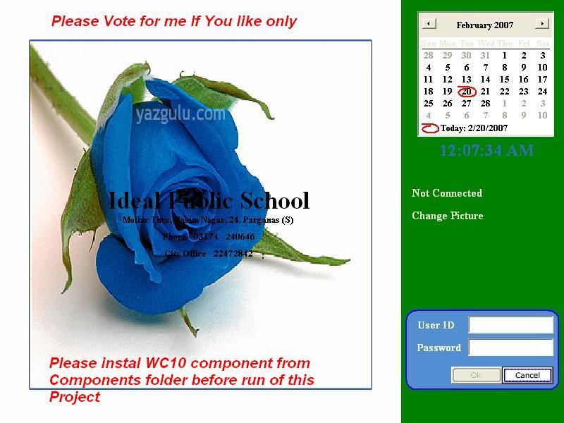

<div align="center">

## School Fees Management


</div>

### Description

NOTE: Read the Follow Instruction word file from the Documentation Folder. This forlder is compressed with WinRar software (.rar). You can download this software from www.phazeddl.com

UserID/Password is aa/aa

This project developed to keep information about the fees,stdent information and Results. This is fully auto,userfraindly, and well maintaned. Because there was the demand that who will operate this software doesnot know much more about the Software and Computer. So this is developed on the basis of just install software and start working. No setting, No Database creation, no pre-entry of default database etc.

This is a complete software with all need of today live project. It will give you idead about.

1- Use of registry

2- Use of automatic database creation in SQLServer

3- Use of well structured database such Storedprocedure, Backup Data, Restore Data.

4- Use of default color / user choice color such as textbox depth/Font Color/Form Color/Font Style etc.

5- Use of User control.

6- Use of MS-Office Component ( A third party software)

7- Use of Data Environment and ODBC

8- And many more.

After reviewing this project you will get a complete Idea abaout Live Project......

If you feel it is good and feeded you with some knowledge, please VOTE me as well as post comments to gain more Idea about the projects.

NITE::-&gt;Download MS-Office Component which nacessary for this project from given links

http://www.microsoft.com/downloads/details.aspx?FamilyID=982b0359-0a86-4fb2-a7ee-5f3a499515dd&amp;displaylang=en
 
### More Info
 
This is a complete software with all need of today live project. It will give you idead about.

1- Use of registry

2- Use of automatic database creation in SQLServer

3- Use of well structured database such Storedprocedure, Backup Data, Restore Data.

4- Use of default color / user choice color such as textbox depth/Font Color/Form Color/Font Style etc.

5- Use of User control.

6- Use of MS-Office Component ( A third party software)

7- Use of Data Environment and ODBC

8- And many more.

After reviewing this project you will get a complete Idea abaout Live Project......

If you feel it is good and feeded you with some knowledge, please VOTE me as well as post comments to gain more Idea about the projects.

Download MS-Office Component which nacessary for this project from given links

http://www.microsoft.com/downloads/details.aspx?FamilyID=982b0359-0a86-4fb2-a7ee-5f3a499515dd&amp;displaylang=en

This software will run with MS-Office XP which must install on the computer. If you dont have MS-Office XP then I have included a MS-Office Web Component in the Compnents folder of this software name is WC10. Just install it before running of this software.


<span>             |<span>
---                |---
**Submitted On**   |2007-02-23 07:00:02
**By**             |[Minhajul Islam](https://github.com/Planet-Source-Code/PSCIndex/blob/master/ByAuthor/minhajul-islam.md)
**Level**          |Advanced
**User Rating**    |4.9 (49 globes from 10 users)
**Compatibility**  |VB 5\.0, VB 6\.0
**Category**       |[Complete Applications](https://github.com/Planet-Source-Code/PSCIndex/blob/master/ByCategory/complete-applications__1-27.md)
**World**          |[Visual Basic](https://github.com/Planet-Source-Code/PSCIndex/blob/master/ByWorld/visual-basic.md)
**Archive File**   |[School\_Fee2049612232007\.zip](https://github.com/Planet-Source-Code/minhajul-islam-school-fees-management__1-67931/archive/master.zip)

### API Declarations

```
It will give you idead about.
1- Use of registry
2- Use of automatic database creation in SQLServer
3- Use of well structured database such Storedprocedure, Backup Data, Restore Data.
4- Use of default color / user choice color such as textbox depth/Font Color/Form Color/Font Style etc.
5- Use of User control.
6- Use of MS-Office Component ( A third party software)
7- Use of Data Environment and ODBC
8- And many more.
```


